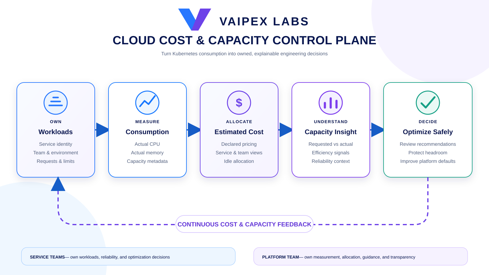
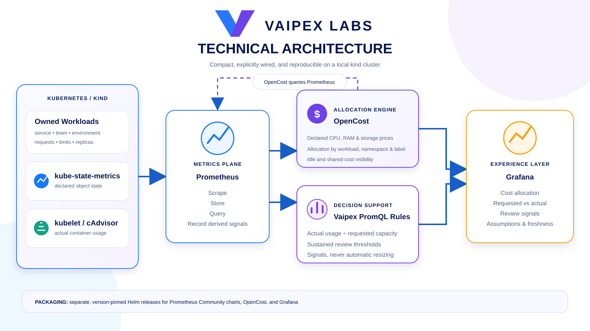

# Vaipex Cloud Cost & Capacity Control Plane

An open reference implementation for connecting Kubernetes resource
consumption, cost allocation, capacity efficiency, and service ownership.

Developed by **Vaipex Labs** for the developer and platform engineering
community.


[Project at a Glance](#project-at-a-glance) ·
[Why This Project Exists](#why-this-project-exists) ·
[Intended Flow](#intended-flow) ·
[Component Architecture](#component-architecture) ·
[Project Boundaries](#project-boundaries) ·
[Delivery Roadmap](#delivery-roadmap)

## Project at a Glance

| Area | Intended capability |
| --- | --- |
| Cost allocation | Estimate Kubernetes workload cost by service, team, namespace, and environment |
| Capacity visibility | Compare requested CPU and memory with actual utilization |
| Ownership | Connect cost and optimization signals to stable service-team identities |
| Efficiency | Surface idle, over-provisioned, and under-provisioned capacity |
| Decision support | Turn cost and utilization data into explainable recommendations |
| Visualization | Present cost, capacity, and ownership signals through dashboards |
| Developer experience | Provide a repeatable local demonstration without cloud credentials |

## Why This Project Exists

Kubernetes makes it easy to request compute capacity, but the resulting cost and
efficiency signals are often separated from the teams making workload decisions.
Cloud invoices show aggregate spend, while service teams think in terms of CPU,
memory, replicas, environments, and reliability requirements.

This project demonstrates a platform-owned FinOps model that translates shared
infrastructure consumption into engineering context. It is intended to help
platform teams make cost visible without turning optimization into an opaque
finance exercise or automatically trading away service reliability.

## Intended Flow



The operating principle is:

> Make cost and capacity visible in engineering terms, attach them to service
> ownership, and support decisions without automatically sacrificing
> reliability.

## Component Architecture

The project uses a compact, explicitly wired stack instead of the broader
`kube-prometheus-stack`. This keeps the learning surface focused on the minimum
components required for cost allocation and capacity analysis.



| Component | Responsibility |
| --- | --- |
| kind | Provide a reproducible local Kubernetes cluster |
| kube-state-metrics | Expose workload requests, limits, identity, and ownership metadata |
| kubelet/cAdvisor | Expose actual container CPU and memory consumption |
| Prometheus | Collect and store resource, utilization, and cost metrics |
| OpenCost | Apply declared prices and calculate Kubernetes cost allocations |
| Vaipex PromQL rules | Compare requested capacity with usage and produce review signals |
| Grafana | Present cost, capacity, ownership, assumptions, and data freshness |

OpenCost answers **what estimated cost is allocated to a workload**. The Vaipex
recording rules answer **how requested capacity compares with actual use and
whether human review is warranted**. The rules will not resize workloads or
treat low utilization alone as proof of waste.

### Packaging decision

The local platform will install separate, version-pinned Helm releases for:

1. A compact Prometheus Community metrics stack.
2. OpenCost.
3. Grafana.

This approach makes the data flow and integration points visible. The larger
`kube-prometheus-stack` is intentionally not used because its additional
operators, alerting components, and predefined monitoring resources are beyond
the cost-and-capacity scope of this lab.

## Intended Users

- Platform engineering teams operating Kubernetes.
- Service owners tuning workload capacity.
- FinOps teams seeking transparent allocation and showback.
- Engineering leaders balancing cost, reliability, and growth.

## Project Boundaries

The reference implementation will use a local kind cluster and configurable
pricing. Its results represent **cost allocation estimates**, not a cloud bill.
This keeps the project free, portable, and reproducible without AWS, Azure, or
Google Cloud credentials.

### In scope

- Two sample services with contrasting resource profiles.
- Team, service, namespace, and environment ownership metadata.
- CPU and memory requests, limits, and actual utilization.
- OpenCost-based workload allocation estimates.
- Idle and inefficient capacity signals.
- Explainable optimization recommendations.
- Prometheus metrics and Grafana dashboards.
- A short end-to-end demonstration with automatic cleanup.

### Out of scope

- Cloud invoice reconciliation.
- Financial accounting or chargeback.
- Automatic modification of workload resources.
- Cost-driven autoscaling.
- Multi-cluster or multi-cloud aggregation.
- A required public-cloud account.

## Delivery Roadmap

- [x] Define the problem, intended users, outcomes, and project boundaries.
- [x] Select the component architecture and define each tool's responsibility.
- [x] Establish the repository foundation, license, and contribution guidance.
- [x] Create the local Kubernetes and metrics platform lifecycle.
- [x] Deploy owned workloads with contrasting capacity profiles.
- [x] Add OpenCost with explicit local pricing assumptions.
- [x] Expose cost allocation by service, team, namespace, and environment.
- [x] Compare requested capacity with actual utilization.
- [x] Produce explainable optimization recommendations.
- [ ] Add dashboards and actionable cost-capacity views.
- [ ] Add automated validation and a two-minute demonstration.
- [ ] Add operational guidance and polish the community-facing project.

## Design Principles

- Cost estimates disclose their pricing assumptions.
- Ownership uses team or service identities, not individual names.
- Recommendations remain explainable and reviewable.
- Reliability context accompanies every optimization opportunity.
- The platform supports decisions; it does not make unsafe automatic changes.
- The reference implementation remains portable and replaceable by design.

## Run Locally

Prerequisites: Docker Desktop, kind `v0.32.0`, kubectl, Helm, `curl`, and `jq`.

```bash
./scripts/start-local.sh
```

This creates the dedicated `vaipex-cost-capacity` kind cluster with a
digest-pinned Kubernetes `v1.36.1` node. It installs Prometheus `v3.13.2` from
Prometheus Community chart `29.24.0`, retains kube-state-metrics and
node-exporter, and verifies that declared workload state and actual cAdvisor
usage are queryable. It then deploys two synthetic services:

| Workload | Behavior | CPU request | Memory request | Ownership |
| --- | --- | ---: | ---: | --- |
| `checkout-api` | Performs small, repeated compute operations | 100m | 64Mi | `commerce-platform` |
| `report-generator` | Remains mostly idle | 500m | 256Mi | `data-platform` |

The contrast is deliberate: the active service has a modest allocation while
the idle service reserves five times more CPU and four times more memory. Both
use the same digest-pinned multi-architecture image, restricted security
settings, explicit resource limits, health probes, and stable service, owner,
environment, cost-center, and capacity-profile labels. This isolates capacity
intent from application-framework differences and supplies attribution data to
the control plane.

Alertmanager and Pushgateway are excluded because this lab does not currently
use either capability. Local metrics use six-hour ephemeral retention and
disappear with the cluster.

### Pricing assumptions

OpenCost `1.121.1` is installed from chart `2.5.29` and reads the local
Prometheus service. The lab intentionally uses simple illustrative USD prices:

| Resource | Declared price |
| --- | ---: |
| CPU | $0.040 per core-hour |
| RAM | $0.005 per GiB-hour |
| Persistent storage | $0.00014 per GiB-hour |
| Internet egress | $0.12 per GiB |

These declared prices make the allocation math reproducible. They are not
provider quotes, negotiated rates, invoice reconciliation, or financial
advice. Change `deploy/opencost/values.yaml` to model another pricing baseline.

To open the OpenCost interface after startup:

```bash
kubectl --context kind-vaipex-cost-capacity \
  --namespace opencost port-forward service/opencost 19090:9090
```

Then visit <http://localhost:19090>.

### Cost and capacity report

After the platform has collected several minutes of data, run:

```bash
./scripts/show-cost-capacity.sh
```

The report joins OpenCost allocation with the labels attached to each workload
and displays service, owner/team, environment, CPU and memory requests, actual
usage, efficiency, and an hourly cost estimate. Prometheus recording rules also
publish stable requested-capacity, actual-usage, and utilization-ratio metrics
for dashboards and ad hoc analysis.

Recommendations use two intentionally simple, visible thresholds:

- Review lower requests only when both CPU efficiency is below 10% and memory
  efficiency is below 20%.
- Review headroom when either CPU or memory exceeds 80% of its request.
- Otherwise, continue observing the workload.

These are decision-support signals, not resize instructions. A service owner
must consider demand patterns, reliability targets, startup behavior, and
expected growth before changing resources.

Reapply and verify only the sample workloads with:

```bash
./scripts/deploy-workloads.sh
./scripts/verify-workloads.sh
```

Remove only this project's cluster with:

```bash
./scripts/stop-local.sh
```

## Current Status

The cost, ownership, capacity-comparison, and recommendation data path is
complete. The next milestone presents these signals in Grafana.

## Contributing

Community contributions are welcome. Read [CONTRIBUTING.md](CONTRIBUTING.md)
for contribution expectations. Report potential vulnerabilities according to
[SECURITY.md](SECURITY.md), not through a public issue.

Licensed under the [Apache License 2.0](LICENSE).
